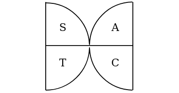

# Convert Drawing App

Convert Drawing is a test app that runs on native Javascript. The dev packages currently used are:

- "body-parser": "~1.18.2",
- "cookie-parser": "~1.4.3",
- "debug": "~2.6.9",
- "express": "~4.15.5",
- "jade": "~1.11.0",
- "morgan": "~1.9.0",
- "serve-favicon": "~2.4.5"

Here's a video of the prototype created for Convert Drawing:


## Doors



The door design has been prepared based on a property that determines what changes when movement is from one room to another. It is a scale that completely lies in classification side. But All (A), Sine (S), Tan (T), Cos (C) is a determining technique to distinguish that property simply because it can be represented using the complex plane which is:

```Javascript

var xCoordinate = width * Math.cos(angle * Math.PI/180 + xAngleAppend), yCoordinate = width * Math.sin(angle * Math.PI/180 + yAngleAppend);

```

## Walls

- Closed

- Single Disconnected

- Double Disconnected

- Double Enclosure

- Triple Enclosure

Interface of the prototype app:


## Design of the prototype

The prototype is designed to work with browsers that support Javascript. The prototype uses the native library which enables light-weight javascript engines to load the prototype. 